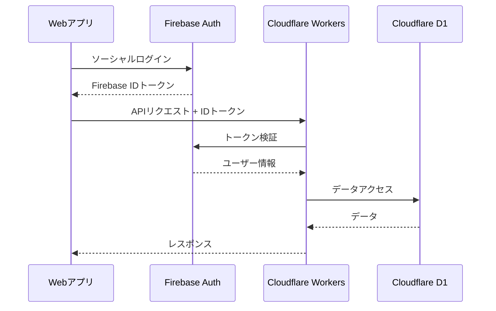

# 技術仕様書 (Architecture Design Document)

## テクノロジースタック

### 言語・ランタイム

| 技術 | バージョン | 選定理由 |
|------|-----------|----------|
| Node.js | v24.11.0 | 開発ツール、ビルド |
| TypeScript | 5.x | 静的型付けによる品質向上 |
| npm | 11.x | Node.js標準搭載 |

### フロントエンド（Web/PWA）- Phase 1

| 技術 | バージョン | 用途 | 選定理由 |
|------|-----------|------|----------|
| React | 19.x | UIライブラリ | コンポーネントベース、エコシステム充実 |
| Vite | 6.x | ビルドツール | 高速HMR、ESM対応、PWAプラグイン |
| TypeScript | 5.x | 型安全 | 開発効率向上、バグ防止 |
| Zustand | 5.x | 状態管理 | 軽量、シンプルなAPI |
| React Router | 7.x | ルーティング | SPAナビゲーション |
| Tailwind CSS | 4.x | スタイリング | ユーティリティファースト、高速開発 |
| react-swipeable | 7.x | スワイプ操作 | タッチジェスチャー対応 |
| react-player | 2.x | 動画プレイヤー | 終了検知、カスタマイズ可能 |

### バックエンド（API）- Phase 3以降

| 技術 | バージョン | 用途 | 選定理由 |
|------|-----------|------|----------|
| Hono | 4.x | APIフレームワーク | 軽量・高速、TypeScript対応 |
| Drizzle ORM | 0.36.x | ORM | 型安全、軽量、SQLライクな記法 |
| PostgreSQL | 16.x | データベース | 信頼性、スケーラビリティ |
| Zod | 3.x | バリデーション | TypeScript統合、スキーマ定義 |

### インフラ・サービス - 段階的導入

| 技術 | 用途 | 導入フェーズ |
|------|------|------------|
| Vercel / Cloudflare Pages | 静的ホスティング | Phase 1〜 |
| Cloudflare Workers | APIホスティング | Phase 3〜 |
| Cloudflare D1 | データベース | Phase 3〜 |
| Cloudflare Stream | 動画配信 | 必要時 |
| Firebase Auth | 認証 | 必要時 |

### 開発ツール

| 技術 | バージョン | 用途 | 選定理由 |
|------|-----------|------|----------|
| Vitest | 2.x | テスト | 高速、ESM対応、TypeScript統合 |
| ESLint | 9.x | Linter | コード品質維持 |
| Prettier | 3.x | Formatter | コードスタイル統一 |
| Playwright | 1.x | E2Eテスト | クロスブラウザ対応 |

---

## アーキテクチャパターン

### Phase 1（MVP）全体構成

```
┌─────────────────────────────────────────────────────────────┐
│                 Web/PWA (React + Vite)                      │
├─────────────────────────────────────────────────────────────┤
│  ┌─────────────┐  ┌─────────────┐  ┌─────────────────────┐  │
│  │ UI Components│  │   Pages     │  │  Router             │  │
│  └──────┬──────┘  └──────┬──────┘  └─────────────────────┘  │
│         │                │                                   │
│  ┌──────▼────────────────▼──────┐                           │
│  │        State (Zustand)        │                           │
│  └──────────────┬───────────────┘                           │
│                 │                                            │
│  ┌──────────────▼───────────────┐                           │
│  │      Local Storage Service    │                           │
│  │   (localStorage / IndexedDB)  │                           │
│  └──────────────────────────────┘                           │
└─────────────────────────────────────────────────────────────┘
                  │ 静的コンテンツ取得
┌─────────────────▼───────────────────────────────────────────┐
│  ┌─────────────────────────────────────────────────────┐    │
│  │     静的ファイル（動画、JSON）                        │    │
│  │     - content/movies/                               │    │
│  │     - content/data/                                 │    │
│  └─────────────────────────────────────────────────────┘    │
└─────────────────────────────────────────────────────────────┘
```

### Phase 3以降（サーバ連携時）全体構成

```
┌─────────────────────────────────────────────────────────────┐
│                 Web/PWA (React + Vite)                      │
├─────────────────────────────────────────────────────────────┤
│  ┌─────────────┐  ┌─────────────┐  ┌─────────────────────┐  │
│  │ UI Components│  │   Pages     │  │  Router             │  │
│  └──────┬──────┘  └──────┬──────┘  └─────────────────────┘  │
│         │                │                                   │
│  ┌──────▼────────────────▼──────┐                           │
│  │        State (Zustand)        │                           │
│  └──────────────┬───────────────┘                           │
│                 │                                            │
│  ┌──────────────▼───────────────┐  ┌─────────────────────┐  │
│  │      API Client (fetch)       │  │  Local Storage      │  │
│  └──────────────┬───────────────┘  └─────────────────────┘  │
└─────────────────┼───────────────────────────────────────────┘
                  │ HTTPS
┌─────────────────▼───────────────────────────────────────────┐
│                  Cloudflare Workers (API)                    │
├─────────────────────────────────────────────────────────────┤
│  ┌─────────────┐  ┌─────────────┐  ┌─────────────────────┐  │
│  │   Routes    │  │ Middleware  │  │   Handlers          │  │
│  │   (Hono)    │  │ (Auth/CORS) │  │                     │  │
│  └──────┬──────┘  └─────────────┘  └──────┬──────────────┘  │
│         │                                  │                 │
│  ┌──────▼──────────────────────────────────▼──────────────┐ │
│  │              Services (Business Logic)                  │ │
│  └──────────────────────────┬─────────────────────────────┘ │
│                             │                                │
│  ┌──────────────────────────▼─────────────────────────────┐ │
│  │              Repository (Drizzle ORM)                   │ │
│  └──────────────────────────┬─────────────────────────────┘ │
└─────────────────────────────┼───────────────────────────────┘
                              │
┌─────────────────────────────▼───────────────────────────────┐
│  ┌─────────────┐  ┌─────────────┐  ┌─────────────────────┐  │
│  │ Cloudflare  │  │   動画      │  │    Firebase Auth    │  │
│  │     D1      │  │ (CDN)       │  │     (必要時)        │  │
│  └─────────────┘  └─────────────┘  └─────────────────────┘  │
└─────────────────────────────────────────────────────────────┘
```

### 動画コンテンツ配信方式

**Phase 1（開発・MVP）**:
- ローカルファイル（`content/movies/`）を直接参照
- 静的ホスティングからの配信

**Phase 3以降（本番・選択肢）**:
1. **静的ホスティング**: 動画をそのまま配信（シンプル）
2. **Cloudflare Stream**: CDN経由で配信（大規模時）

```
content/movies/
├── history/
│   ├── ancient/
│   │   ├── 001_jomon.mp4
│   │   └── 002_yayoi.mp4
│   └── medieval/
│       └── ...
└── geography/    # 将来の教科
    └── ...
```

---

## Webアプリ レイヤードアーキテクチャ

```
┌─────────────────────────────────────┐
│   Presentation Layer (UI)           │ ← 画面表示、ユーザー操作
├─────────────────────────────────────┤
│   Application Layer (State/Hooks)   │ ← 状態管理、ビジネスロジック
├─────────────────────────────────────┤
│   Infrastructure Layer              │ ← ストレージ、API通信
└─────────────────────────────────────┘
```

### Presentation Layer
- **責務**: 画面表示、ユーザー入力の受付
- **許可される操作**: Hooksの呼び出し、Zustand Storeの参照
- **禁止される操作**: 直接のストレージアクセス、ビジネスロジックの実装

### Application Layer
- **責務**: 状態管理、ビジネスロジック、データ変換
- **許可される操作**: Infrastructure Layerの呼び出し
- **禁止される操作**: UI要素への直接アクセス

### Infrastructure Layer
- **責務**: 外部通信（localStorage、API）
- **許可される操作**: ストレージ操作、ネットワーク通信
- **禁止される操作**: ビジネスロジックの実装

---

## データ永続化戦略

### Phase 1〜2: ローカルストレージ

| データ種別 | ストレージ | フォーマット | 理由 |
|-----------|----------|-------------|------|
| ユーザー設定 | localStorage | JSON | シンプル、即時同期 |
| 学習ログ | localStorage / IndexedDB | JSON | 容量に応じて選択 |
| セッション状態 | localStorage | JSON | 中断復帰用 |
| コンテンツ（動画/問題） | 静的ファイル | JSON / MP4 | サーバ不要 |

### Phase 3以降: サーバ連携

| データ種別 | ストレージ | フォーマット | 理由 |
|-----------|----------|-------------|------|
| ユーザー情報 | Cloudflare D1 | SQLite | リレーショナル |
| 学習統計 | Cloudflare D1 | SQLite | 集計クエリ対応 |
| 学習ログ | Cloudflare D1 | SQLite | 永続保存 |
| ローカルキャッシュ | localStorage | JSON | オフライン対応 |

### ローカルストレージ設計

```typescript
// ストレージキー
const STORAGE_KEYS = {
  SETTINGS: 'oneq_settings',      // UserSettings
  SESSION: 'oneq_session',        // SessionState
  LOGS: 'oneq_logs',              // LearningLog[]
  STATS: 'oneq_stats',            // QuestionStats[] (Phase 3)
  PRESETS: 'oneq_presets',        // RangePreset[] (Phase 4)
} as const;
```

---

## パフォーマンス要件

### レスポンスタイム

| 操作 | 目標時間 | 測定環境 |
|------|---------|---------|
| 初回ロード | 3秒以内 | 4G回線 |
| 画面遷移（スワイプ） | 300ms以内 | スマホブラウザ |
| 動画再生開始 | 2秒以内 | 4G回線 |
| 問題表示 | 100ms以内 | キャッシュ済み |

### リソース使用量

| リソース | 上限 | 理由 |
|---------|------|------|
| 初回ロードサイズ | 500KB (gzip) | 読み込み時間短縮 |
| localStorage | 5MB | ブラウザ制限内 |
| 動画キャッシュ | ブラウザ依存 | 標準キャッシュ使用 |

### 動画プリロード戦略

```typescript
// 次の動画を先読み
class VideoPreloader {
  private prefetchQueue: string[] = [];
  private maxPrefetch = 1;  // 1本先読み（モバイル通信考慮）

  async prefetchNext(currentIndex: number, videos: Video[]) {
    const nextVideo = videos[currentIndex + 1];
    if (nextVideo && !this.isCached(nextVideo.id)) {
      await this.prefetch(nextVideo.videoUrl);
    }
  }
}
```

---

## セキュリティアーキテクチャ

### Phase 1〜2（認証なし）

- ユーザー識別: 端末ローカルのみ（識別子なし）
- データ保護: ブラウザのlocalStorage保護に依存
- 通信: HTTPS必須

### Phase 3以降（認証導入時）

**認証フロー**:


**データ保護**:
- 通信暗号化: 全通信はHTTPS（TLS 1.3）
- 個人情報最小化: ユーザーIDと必要最小限のみ

### 入力検証

```typescript
// Zodによるスキーマ定義
const userSettingsSchema = z.object({
  autoPlayNextVideo: z.boolean(),
});

const orderModeSchema = z.enum(['sequential', 'random', 'smart']);
```

---

## スケーラビリティ設計

### 段階的拡張パス

```
Phase 1-2                    Phase 3                     Phase 4+
┌──────────────┐            ┌──────────────┐            ┌──────────────┐
│  Static      │ ────────>  │  API +       │ ────────>  │  CDN +       │
│  Hosting     │            │  Database    │            │  Scale Out   │
│              │            │              │            │              │
│  localStorage│            │  D1 + Cache  │            │  Multi DB    │
└──────────────┘            └──────────────┘            └──────────────┘
```

### 機能拡張性

```
src/
├── components/           # UIコンポーネント
│   ├── player/          # プレイヤー関連
│   ├── home/            # ホーム画面関連
│   └── common/          # 共通コンポーネント
├── stores/              # Zustand状態管理
├── services/            # ビジネスロジック
├── hooks/               # カスタムフック
└── utils/               # ユーティリティ
```

- 機能単位でのコード分割
- 将来の機能追加時も既存コードへの影響を最小化

---

## テスト戦略

### ユニットテスト

- **フレームワーク**: Vitest
- **対象**:
  - サービスクラス（RangeContentService等）
  - ユーティリティ関数
  - Zodスキーマ
- **カバレッジ目標**: 80%以上

```typescript
// テスト例
describe('RangeContentService', () => {
  it('選択されたフォルダから動画リストを生成する', () => {
    const folders = [...]; // テストデータ
    const selectedIds = ['folder1', 'folder2'];
    const orderMode = 'sequential';

    const videos = RangeContentService.createVideoListFromFolders(
      folders, selectedIds, orderMode
    );

    expect(videos).toHaveLength(2);
  });
});
```

### E2Eテスト

- **ツール**: Playwright
- **シナリオ**:
  - ホーム → 学習開始 → 動画視聴 → 問題回答 → 完了
  - 設定変更 → 反映確認
  - 中断 → 再開

```typescript
// playwright/tests/learning-flow.spec.ts
test('連続学習フロー', async ({ page }) => {
  await page.goto('/');
  await page.click('text=連続学習をはじめる');
  await expect(page.locator('video')).toBeVisible();
  // 動画終了を待機
  await page.waitForSelector('text=答えを見る');
  await page.click('text=答えを見る');
  await page.click('text=正解');
});
```

---

## 技術的制約

### 環境要件

**対応ブラウザ**:
- iOS: Safari 15.0以上
- Android: Chrome 最新〜2世代

**開発環境**:
- Node.js: v24.11.0
- npm: 11.x

### パフォーマンス制約

- 初回ロード: 3秒以内（4G回線）
- 動画ファイルサイズ: 1本あたり50MB以下推奨

### ブラウザ制約

- localStorage: 約5MB
- IndexedDB: 端末依存（通常50MB以上）
- Service Worker: PWA対応に必要

---

## 依存関係管理

### フロントエンド（package.json）

| ライブラリ | 用途 | バージョン管理方針 |
|-----------|------|-------------------|
| react | UIライブラリ | メジャーバージョン固定 |
| vite | ビルドツール | ^（マイナー許可） |
| zustand | 状態管理 | ^（マイナー許可） |
| tailwindcss | スタイリング | ^（マイナー許可） |
| react-swipeable | ジェスチャー | ^（マイナー許可） |
| react-player | 動画プレイヤー | ^（マイナー許可） |

### 更新方針

- **週次**: セキュリティパッチの確認・適用
- **月次**: マイナーバージョンアップの検討
- **四半期**: メジャーバージョンアップの計画
