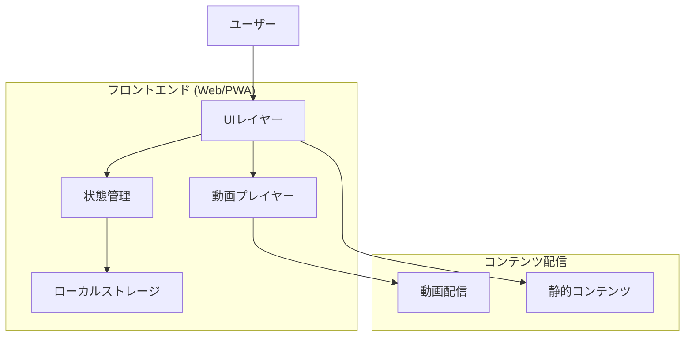
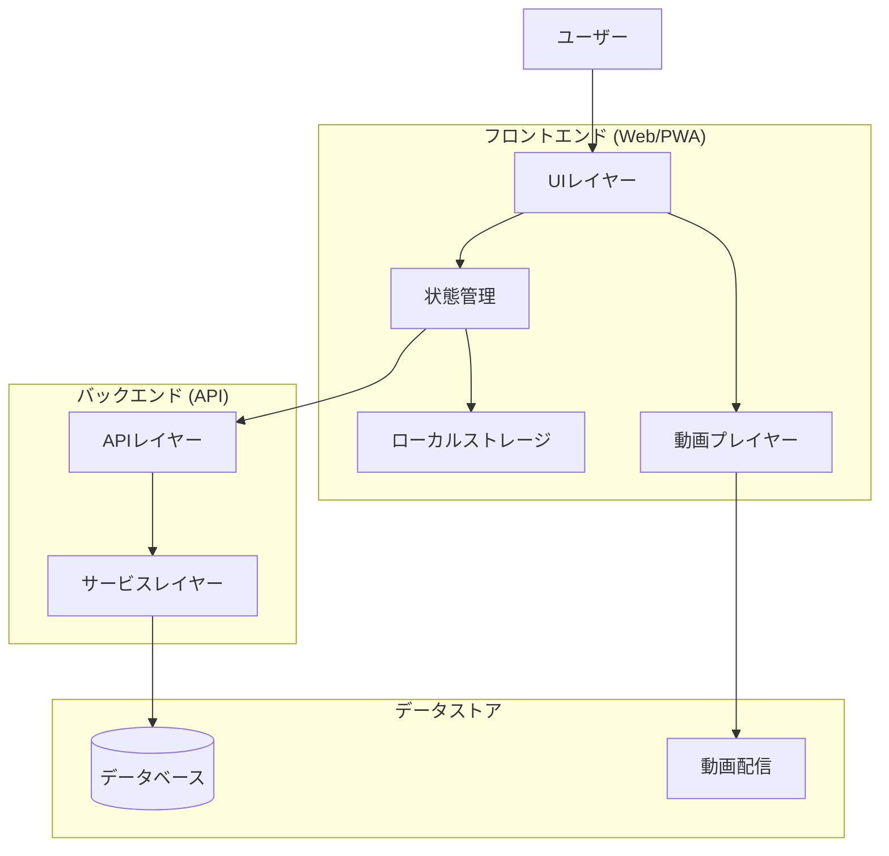
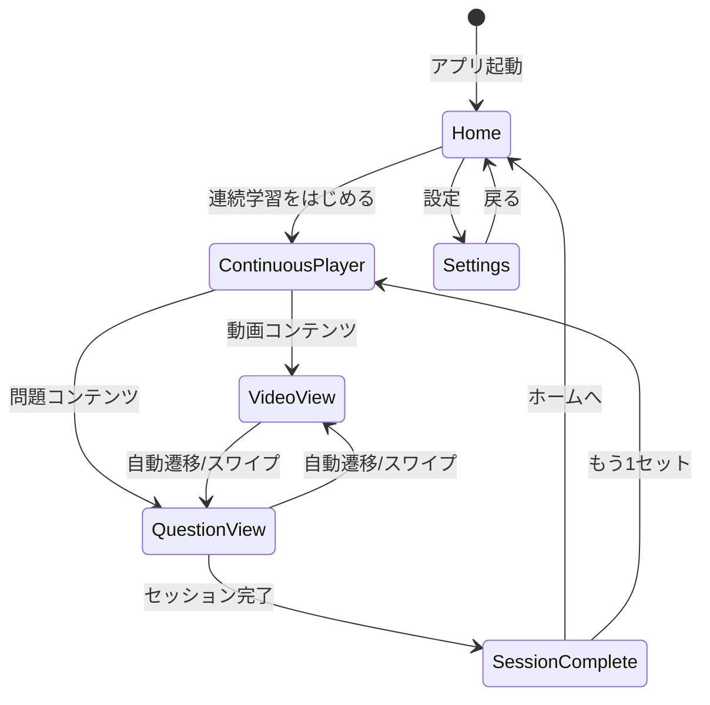
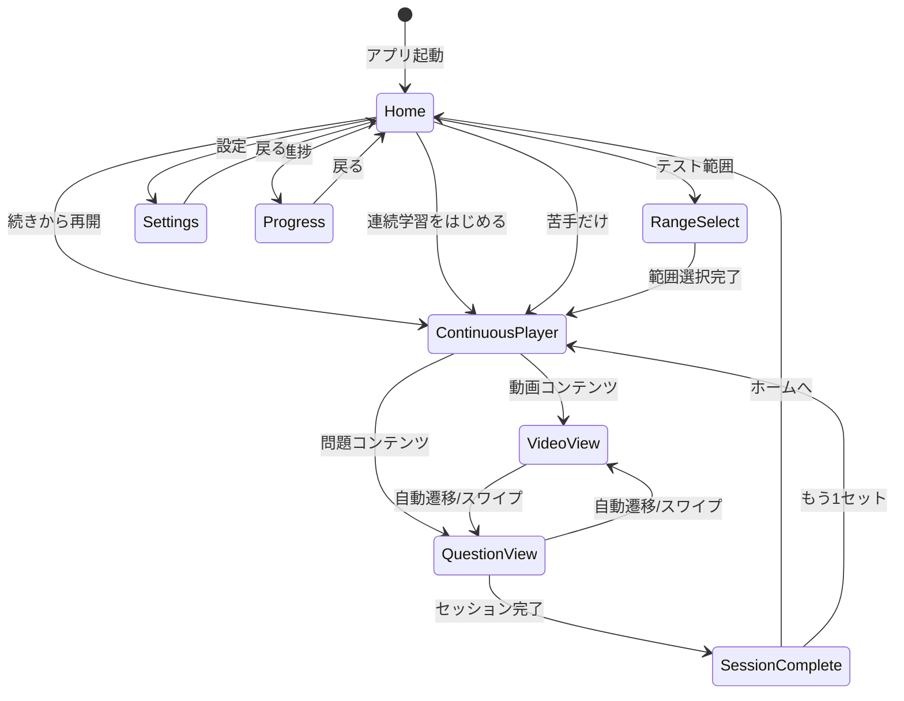

# 機能設計書 (Functional Design Document)

## システム構成図

### Phase 1（MVP）構成



### Phase 3以降（サーバ連携時）



## 技術スタック

### Phase 1（MVP）

| 分類 | 技術 | 選定理由 |
|------|------|----------|
| フロントエンド | React + Vite | 高速ビルド、PWA対応、TypeScript統合 |
| 状態管理 | Zustand | 軽量、シンプルなAPI |
| ローカル保存 | localStorage / IndexedDB | 端末内保存、サーバ不要 |
| 動画プレイヤー | HTML5 Video / React Player | 終了検知対応、カスタマイズ可能 |
| スタイリング | Tailwind CSS | ユーティリティファースト、高速開発 |
| ジェスチャー | react-swipeable | スワイプ操作対応 |

### Phase 3以降（サーバ連携時）

| 分類 | 技術 | 選定理由 |
|------|------|----------|
| バックエンドAPI | Node.js + Hono | TypeScript統一、高速、軽量 |
| データベース | PostgreSQL / Cloudflare D1 | リレーショナル、スケーラブル |
| 認証 | Firebase Auth（必要時） | ソーシャルログイン対応 |
| 動画配信 | Cloudflare Stream（必要時） | 低遅延、アダプティブビットレート |

---

## データモデル定義

### Phase 1 データモデル（端末内保存）

#### Video（動画）

```typescript
interface Video {
  id: string;                    // 動画ID
  title: string;                 // 動画タイトル
  tags: string[];                // タグ（時代/テーマ等）
  videoUrl: string;              // 動画URL（ローカル or CDN）
  thumbnailUrl?: string;         // サムネイルURL
  durationSeconds?: number;      // 動画の長さ（秒）
  orderIndex: number;            // 表示順
}
```

#### Question（問題）

```typescript
interface Question {
  id: string;                    // 問題ID
  videoId: string;               // 関連動画ID
  questionText: string;          // 問題文
  answerText: string;            // 正解
  explanation?: string;          // 解説（任意）
  orderIndex: number;            // 動画内での順番
}
```

#### UserSettings（ユーザー設定）

```typescript
interface UserSettings {
  videosPerSession: number;      // 1セットの動画本数 (3 | 5 | 10)
  autoNextVideo: boolean;        // 動画終了→問題 自動遷移
  autoNextQuiz: boolean;         // 問題終了→動画 自動遷移
}

// デフォルト値（Phase 1）
const DEFAULT_SETTINGS: UserSettings = {
  videosPerSession: 5,
  autoNextVideo: true,
  autoNextQuiz: true,
};
```

#### LearningLog（学習ログ）

```typescript
interface LearningLog {
  id: string;                    // ログID
  questionId: string;            // 問題ID
  result: 'correct' | 'incorrect'; // 正誤
  timestamp: number;             // タイムスタンプ（Unix ms）
}
```

#### SessionState（セッション状態）

```typescript
interface SessionState {
  currentIndex: number;          // 現在位置
  contents: SessionContent[];    // コンテンツ一覧
  startedAt: number;             // 開始時刻
}

interface SessionContent {
  type: 'video' | 'question';
  contentId: string;             // Video.id or Question.id
  completed: boolean;
}
```

### Phase 2 追加データモデル

```typescript
// Phase 2: カスタマイズ設定の拡張
interface UserSettingsV2 extends UserSettings {
  videosPerQuestionSet: number;  // N本の動画ごとに問題を出す
  questionsPerVideoSet: number;  // 問題をM問出す
  orderMode: 'sequential' | 'random'; // 出題順
}
```

### Phase 3 追加データモデル

```typescript
// Phase 3: 苦手機能
interface QuestionStats {
  questionId: string;            // 問題ID
  totalAttempts: number;         // 総回答数
  correctAttempts: number;       // 正解数
  lastAnsweredAt: number;        // 最終回答日時
}

interface UserSettingsV3 extends UserSettingsV2 {
  orderMode: 'sequential' | 'random' | 'weak_first';
  weakThresholdPercent: number;  // 苦手判定閾値（%）
}
```

### Phase 4 追加データモデル

```typescript
// Phase 4: テスト範囲
interface RangePreset {
  id: string;                    // プリセットID
  name: string;                  // プリセット名（例: 期末テスト範囲）
  tags: string[];                // 対象タグ（時代/単元）
  createdAt: number;
}
```

---

## 画面遷移図

### Phase 1（MVP）



### Phase 3以降（最終形）



---

## コンポーネント設計

### UIレイヤー

#### ContinuousPlayerScreen（連続学習画面）

**責務**:
- 動画/問題の連続表示
- スワイプ操作の処理
- 自動遷移の制御
- 進捗表示

```typescript
interface ContinuousPlayerScreenProps {
  // セッション情報は内部状態で管理
}

// 内部状態
interface PlayerState {
  currentIndex: number;
  contents: SessionContent[];
  isAutoNext: boolean;
}
```

#### VideoPlayer（動画プレイヤー）

**責務**:
- 動画の再生/一時停止
- 再生完了の検知（必須要件）
- 再生位置の管理

```typescript
interface VideoPlayerProps {
  video: Video;
  onComplete: () => void;  // 終了検知（必須）
}
```

#### QuestionCard（問題カード）

**責務**:
- 問題の表示
- 「答えを見る」→「正解/不正解」フロー

```typescript
interface QuestionCardProps {
  question: Question;
  onAnswer: (result: 'correct' | 'incorrect') => void;
}

// Phase 1 問題UIフロー:
// 1. 問題文を表示
// 2. 「答えを見る」ボタン
// 3. 正解を表示
// 4. 「正解 ○」「不正解 ×」2択ボタン
```

### サービスレイヤー

#### SessionService（セッション管理）

**責務**:
- 学習セットの生成
- セッション状態の管理
- 進捗の保存（ローカル）

```typescript
class SessionService {
  // セッション生成
  createSession(settings: UserSettings, videos: Video[], questions: Question[]): SessionContent[];

  // 進捗更新
  updateProgress(index: number): void;

  // 中断位置の取得
  getLastPosition(): SessionState | null;

  // 進捗保存
  saveProgress(state: SessionState): void;
}
```

#### StorageService（ストレージ管理）

**責務**:
- ローカルストレージへの保存/読み込み
- データのシリアライズ/デシリアライズ

```typescript
class StorageService {
  // 設定の保存/取得
  saveSettings(settings: UserSettings): void;
  getSettings(): UserSettings;

  // 学習ログの保存/取得
  saveLearningLog(log: LearningLog): void;
  getLearningLogs(): LearningLog[];

  // セッション状態の保存/取得
  saveSessionState(state: SessionState): void;
  getSessionState(): SessionState | null;
}
```

---

## UI設計

### ホーム画面（Phase 1）

```
┌─────────────────────────────────┐
│  OneQ-OneA                      │
├─────────────────────────────────┤
│                                 │
│                                 │
│  ┌───────────────────────────┐  │
│  │                           │  │
│  │   ▶️ 連続学習をはじめる    │  │
│  │                           │  │
│  └───────────────────────────┘  │
│                                 │
│                                 │
│  ┌───────────────────────────┐  │
│  │        ⚙️ 設定             │  │
│  └───────────────────────────┘  │
│                                 │
│                                 │
└─────────────────────────────────┘
```

### 連続学習画面（動画表示時）

```
┌─────────────────────────────────┐
│  ←                      3/15    │
├─────────────────────────────────┤
│                                 │
│  ┌───────────────────────────┐  │
│  │                           │  │
│  │                           │  │
│  │      🎬 動画プレイヤー     │  │
│  │                           │  │
│  │                           │  │
│  │     advancement ▶️ advancement │  │
│  └───────────────────────────┘  │
│                                 │
│  聖徳太子と冠位十二階          │
│                                 │
│                                 │
├─────────────────────────────────┤
│  ◀️ 前へ    🔄 自動ON    次へ ▶️  │
└─────────────────────────────────┘

← 右スワイプ: 前へ
→ 左スワイプ: 次へ
```

### 連続学習画面（問題表示時）

```
┌─────────────────────────────────┐
│  ←                      4/15    │
├─────────────────────────────────┤
│                                 │
│  ┌───────────────────────────┐  │
│  │                           │  │
│  │  聖徳太子が定めた、       │  │
│  │  役人の位を色で分けた     │  │
│  │  制度は何か？             │  │
│  │                           │  │
│  └───────────────────────────┘  │
│                                 │
│  ┌───────────────────────────┐  │
│  │      答えを見る           │  │
│  └───────────────────────────┘  │
│                                 │
│                                 │
├─────────────────────────────────┤
│  ◀️ 前へ    🔄 自動ON    次へ ▶️  │
└─────────────────────────────────┘
```

### 連続学習画面（正解表示時）

```
┌─────────────────────────────────┐
│  ←                      4/15    │
├─────────────────────────────────┤
│                                 │
│  ┌───────────────────────────┐  │
│  │                           │  │
│  │  聖徳太子が定めた、       │  │
│  │  役人の位を色で分けた     │  │
│  │  制度は何か？             │  │
│  │                           │  │
│  │  ─────────────────────    │  │
│  │  答え: 冠位十二階         │  │
│  │                           │  │
│  └───────────────────────────┘  │
│                                 │
│  ┌─────────┐    ┌─────────┐    │
│  │  ○ 正解  │    │  × 不正解 │    │
│  └─────────┘    └─────────┘    │
│                                 │
├─────────────────────────────────┤
│  ◀️ 前へ    🔄 自動ON    次へ ▶️  │
└─────────────────────────────────┘
```

### 設定画面（Phase 1）

```
┌─────────────────────────────────┐
│  ← 設定                         │
├─────────────────────────────────┤
│                                 │
│  1セットの動画本数              │
│  ┌─────┐ ┌─────┐ ┌─────┐       │
│  │  3  │ │  5  │ │ 10  │       │
│  └─────┘ └─────┘ └─────┘       │
│                                 │
│  ─────────────────────────────  │
│                                 │
│  自動遷移                       │
│  動画終了後に問題へ    [ON/OFF] │
│  問題回答後に動画へ    [ON/OFF] │
│                                 │
│                                 │
└─────────────────────────────────┘
```

### カラーコーディング

**正誤フィードバック**:
- 正解: 緑（#22C55E）
- 不正解: 赤（#EF4444）

**進捗バー**:
- 完了: 青（#3B82F6）
- 未完了: グレー（#E5E7EB）

---

## ローカルストレージ設計

### Phase 1 ストレージキー

| キー | 型 | 説明 |
|------|-----|------|
| `oneq_settings` | UserSettings | ユーザー設定 |
| `oneq_session` | SessionState | 現在のセッション状態 |
| `oneq_logs` | LearningLog[] | 学習ログ履歴 |

### 保存タイミング

- **設定**: 設定変更時に即時保存
- **セッション状態**: 各コンテンツ完了時に保存
- **学習ログ**: 問題回答時に追記保存

### データ移行設計

Phase 3以降でサーバ保存に移行する際の方針:

```typescript
// ローカルデータをサーバへ移行するインターフェース
interface DataMigration {
  // ローカルの学習ログをサーバへ同期
  syncLearningLogs(logs: LearningLog[]): Promise<void>;

  // ローカルの設定をサーバへ同期
  syncSettings(settings: UserSettings): Promise<void>;
}
```

---

## エラーハンドリング

### エラーの分類

| エラー種別 | 処理 | ユーザーへの表示 |
|-----------|------|-----------------|
| 動画読み込みエラー | スキップ提案 | 「動画を読み込めません。スキップしますか？」 |
| ローカルストレージ容量不足 | 古いログ削除提案 | 「ストレージ容量が不足しています」 |
| コンテンツ未取得 | リロード提案 | 「コンテンツを取得できません。再読み込みしてください」 |

---

## パフォーマンス最適化

- **動画プリロード**: 次の動画を事前にバッファリング
- **問題データのプリロード**: セッション開始時に全問題を取得
- **画像最適化**: サムネイルをWebP形式、適切なサイズにリサイズ
- **コード分割**: ルートベースのコード分割でバンドルサイズ削減

---

## PWA対応

### Phase 1（任意）/ Phase 2以降（推奨）

```javascript
// manifest.json
{
  "name": "OneQ-OneA",
  "short_name": "OneQ",
  "display": "standalone",
  "start_url": "/",
  "theme_color": "#3B82F6",
  "background_color": "#FFFFFF",
  "icons": [...]
}
```

**PWA機能**:
- ホーム画面への追加
- スプラッシュスクリーン
- フルスクリーン表示
- （将来）オフライン対応

---

## テスト戦略

### ユニットテスト
- SessionService: セット生成ロジック
- StorageService: 保存/読み込み

### 統合テスト
- 連続学習フロー全体
- 設定変更の反映

### E2Eテスト（実機確認）
- スワイプ感度
- 自動遷移
- 戻る・中断復帰
